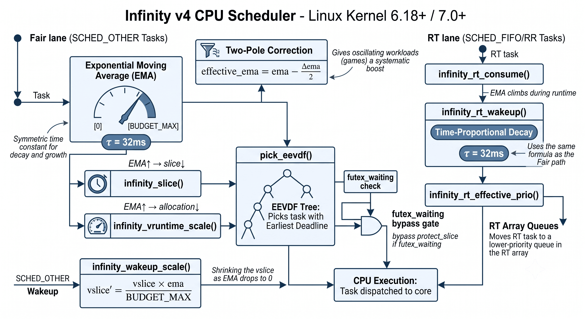

# infinity-scheduler (v4)

A fair-share CPU scheduler based on the limit concept in mathematics — every scheduling parameter approaches its bound asymptotically without discrete thresholds. Interactive tasks that sleep frequently naturally keep their budget; CPU-bound tasks converge toward a minimum. Same concept applies to real-time tasks through smooth priority modulation. Built into CFS/EEVDF and RT, no BPF or sched-ext dependency.

> [!TIP]
> **TL;DR — v4 is about making the EMA fully continuous (no hard resets, no caps).**
>
> Climb and decay now share the same time constant (τ = 32ms), so EMA naturally
> settles at your task's duty cycle — a game that uses 30% CPU stabilises at 30%
> EMA and gets exactly the priority it needs, no tuning required. Wakeup vslice
> approaches zero as EMA drops (instant scheduling on wakeup), and a two-pole
> correction gives oscillating workloads (games, interactive apps) a systematic
> edge over sustained CPU-bound tasks. RT tasks now use the same time-based
> decay formula instead of event-rate-dependent fixed steps.

<p align="center">
  
</p>

## Quick start

```bash
# 1. Clone the v4 branch
git clone -b v4 https://github.com/galpt/infinity-scheduler.git
cd infinity-scheduler

# 2. Build and install (detects running kernel version automatically)
sudo bash tools/install-infinity-scheduler.sh

# 3. Reboot and select "Infinity scheduler kernel" at the boot menu
reboot
```

> [!TIP]
> `sudo bash tools/install-infinity-scheduler.sh --remove` removes only Infinity
> scheduler boot entries — the default kernel is never touched.

```bash
# Verify it's running
uname -r                              # → 7.0.12-infinity
sysctl kernel.infinity_running        # → kernel.infinity_running = 1
sudo dmesg | grep Infinity            # → Infinity scheduler active: carriage=...
```

## Project structure

```
.
├── assets/                 Architecture diagram
├── src/                    ★ Reference implementation (kernel/sched/infinity_sched.[ch])
├── patches/stable/         0001-infinity-scheduler.patch for each kernel version
├── tools/                  Install script, build helpers, patch fixers
├── CONTRIBUTING.md
└── LICENSE
```

Patches for version X.Y apply to all X.Y.Z point releases with `patch -F 3`.

## Tunables

| Parameter | Default | Range | Description |
|---|---|---|---|
| `infinity_carriage_ns` | 2000000 (2ms) | [1000, 100000000] | Base fair-share window (ns) |
| `infinity_smt_divisor` | 2 | [1, 16] | SMT secondary slice divisor (1 = no halving) |
| `infinity_running` | 1 (ro) | — | Active flag |
| `infinity_reset` | — | — | Write `1` to reset all tunables to defaults |

No auto-tuning sysctl is needed — the EMA is self-stabilizing by construction.

```bash
sudo sysctl kernel.infinity_carriage_ns=4000000     # 4ms base window
sudo sysctl kernel.infinity_reset=1                 # reset to defaults
```

## Feature comparison

| Feature | scx_flow 3.1.0 | infinity-scheduler |
|---|---|---|
| Fair-share slice | Yes | Yes |
| Budget model | Linear consumption | **EMA (Limitless)** |
| SMT halving | No | Yes |
| NULL guard | N/A (BPF) | Yes |
| Wakeup deadline boost | N/A | **Asymptotic vslice** |
| Work stealing | Yes (BPF) | No (not needed — EEVDF + kernel load balancer) |
| RT-stall immunity | No | Yes |

## License

GPL-2.0

## Credits

- **[EEVDF](https://git.kernel.org/pub/scm/linux/kernel/git/torvalds/linux.git/tree/kernel/sched/fair.c)** — Earliest Eligible Virtual Deadline First scheduling algorithm by Ion Stoica and Hussein Abdel-Wahab (1995), implemented in the Linux kernel by Peter Zijlstra and the kernel community. EEVDF serves as the foundation that the Infinity scheduler modifies.
- **[scx_flow 3.1.0](https://github.com/sched-ext/scx/tree/main/scheds/experimental/scx_flow)** — BPF sched-ext fair-share scheduler by the sched-ext community. The budget model and interactive floor logic are adapted from this implementation.
- **[BORE](https://github.com/firelzrd/bore-scheduler)** — Burst-Oriented Response Enhancer scheduler by Masahito S ([firelzrd](https://github.com/firelzrd)). BORE's approach to CPU-bound task suppression through burst scoring provided a reference point for Infinity's accelerating consumption design.
- **[BMQ / PDS / LF-BMQ](https://gitlab.com/alfredchen/projectc)** — BitMap Queue schedulers by Alfred Chen (Project C). Research into BMQ's complete scheduler replacement approach validated the decision to keep Infinity within EEVDF rather than replacing it entirely.
- **[LINUX DO](https://linux.do/)** — Chinese Linux community where the Infinity scheduler is discussed and promoted. Feedback from the community helps shape the project's development direction.
- **[CachyOS community](https://cachyos.org/)** — Testers and early adopters who provided real-world feedback during development, helping validate the scheduler's behavior under diverse workloads.
