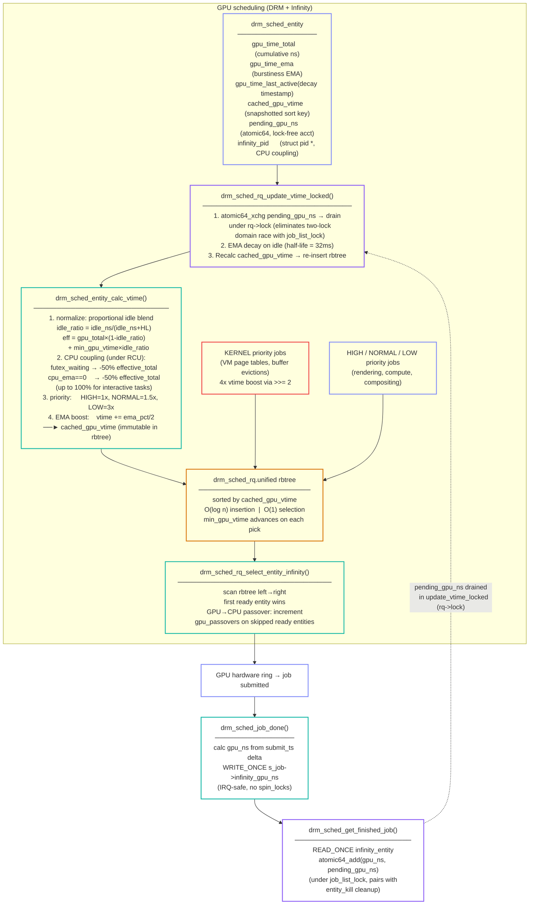

# infinity-scheduler (v4.6-gpu)

A fair-share CPU + GPU scheduler based on the limit concept in mathematics — every scheduling parameter approaches its bound asymptotically without discrete thresholds.

## Project structure

```
.
├── src/                    ★ Reference implementation (kernel/sched/infinity_sched.[ch])
├── patches/
│   ├── arch/6.18/            11 patches — Vanilla kernel.org 6.18
│   ├── arch/7.0/             11 patches — Vanilla kernel.org 7.0
│   ├── arch/7.1/             11 patches — Vanilla kernel.org 7.1
│   └── fedora/7.0/           11 patches — Fedora kernel-ark archived-7.0
├── tools/                     Install script, build helpers, patch fixers
├── CONTRIBUTING.md
└── LICENSE
```

## Quick start

> [!NOTE]
> The install script below is tested and working with the **Limine** bootloader.
> Support for **GRUB** and **systemd-boot** has been added but not yet tested on
> real hardware. If you encounter issues or have a working version for your
> bootloader, please send a pull request.

```bash
# 1. Clone the repo (v4.6-gpu has GPU scheduling; v4.5 is stable CPU-only baseline)
git clone -b v4.6-gpu --depth 1 https://github.com/galpt/infinity-scheduler.git
cd infinity-scheduler

# 2. Build and install (detects running kernel version automatically)
sudo bash tools/install-infinity-scheduler.sh

# 3. Reboot and select "Infinity scheduler kernel" at the boot menu
reboot
```

> [!TIP]
> `sudo bash tools/install-infinity-scheduler.sh --remove` removes only Infinity
> scheduler boot entries — the default kernel is never touched.

```bash
# Verify it's running
uname -r                              # → 7.1-infinity
sysctl kernel.infinity_running        # → kernel.infinity_running = 1
sysctl kernel.infinity_version        # → kernel.infinity_version = v4.6-gpu
sudo dmesg | grep Infinity            # → Infinity scheduler active: smt_divisor=...

# Check GPU scheduling health
cat /proc/sys/kernel/infinity_stats   # → CPU + GPU accounting table with borders
```

> [!NOTE]
> Use `cat` instead of `sysctl` for `infinity_stats` — it outputs a multi-line
> table that `sysctl` cannot display properly. The stats show CPU futex boosts,
> EMA climbs, wakeup decays, RT throttles, and GPU completion/accounting
> breakdown with idle compensation, cross-scheduler coupling, and lock drain
> counters. The Accounting confidence line verifies data integrity.

## Tunables

| Parameter | Default | Range | Description |
|---|---|---|---|
| `infinity_smt_divisor` | 2 | [1, 16] | SMT secondary slice divisor (1 = no halving) |
| `infinity_running` | 1 (ro) | — | Active flag |
| `infinity_version` | v4.6-gpu (ro) | — | Branch version string |
| `infinity_stats` | — (ro) | — | CPU + GPU accounting table with section headers, raw comma-formatted numbers, idle compensation, cross-scheduler coupling counters, lock drain rounds, and accounting confidence |

Infinity uses EEVDF's native per-task weight as its control variable — no
separate fair-share window is needed.  The EMA climb time constant is
approximately 0.5ms at the default alpha (3072), scaling from 0.38ms
(alpha 4096 at max cpu_capacity) to 0.67ms (alpha 2048 at low capacity).
This gives sub-millisecond reaction to CPU-bound threads on any hardware.
No user tunable is needed beyond the SMT divisor.

## CPU scheduling

Interactive tasks that sleep frequently naturally keep their budget while CPU-bound tasks converge toward a minimum, and real-time tasks get adaptive RR timeslices based on CPU burstiness. Built into CFS/EEVDF and RT with a focus on desktop interactivity.


```mermaid
flowchart TB
    classDef fair fill:#0000,stroke:#3b82f6,stroke-width:2
    classDef algo fill:#0000,stroke:#6366f1,stroke-width:2
    classDef wake fill:#0000,stroke:#14b8a6,stroke-width:2
    classDef rtN fill:#0000,stroke:#d97706,stroke-width:2
    classDef infra fill:#0000,stroke:#94a3b8,stroke-width:2

    subgraph FAIR["Fair tasks (SCHED_OTHER)"]
        TASK["Task"] --> GAUGE["EMA gauge\n───\n0 → BUDGET_MAX\nα = 2048–4096\n(scales with cpu_capacity)"]
        class GAUGE fair

        GAUGE --> WEIGHT["infinity_update_weight()\n───\nreweight_entity()\nweight = base × (100 - pct×98/100) / 100\nat EMA=100%: base × 2%"]
        class WEIGHT algo

        WEIGHT --> EEVDF["EEVDF\n───\ndeadline = vruntime + slice/weight\nweight↑ → earlier deadline"]

        TASK --> FUTEX["futex_do_wait()\n───\nsets futex_waiting = true\n→ schedule() → cleared on wakeup"]
        class FUTEX algo

        FUTEX --> PLACE["place_entity()\n───\nif futex_waiting:\nvslice >>= 1\n→ earlier deadline on wakeup"]
        class PLACE algo

        PLACE --> GAUGE
        class EEVDF algo

        EEVDF --> RUN["Task runs\nuntil block or preempt"]
        class RUN fair

        subgraph WAKEUP["Wakeup path"]
            WQ["enqueue_task_fair()"]
            WQ --> DECAY["infinity_wakeup()\n───\nema = f(sleep_ns)\nperiod-shift bounds tracking\n& 128-bit math safety"]
            DECAY --> WAKE["Waking task\nhas higher weight →\nnaturally earlier deadline"]
            WAKE --> RUN
        end
        class DECAY wake

        RUN -. "block / preempt" .-> WAKEUP
        RUN --> GAUGE
    end

    subgraph RT["RT tasks (SCHED_RR / SCHED_FIFO)"]
        RT_T["SCHED_RR task runs"] --> RT_C["infinity_rt_consume()\n───\nrt_ema climbs with runtime"]
        class RT_C rtN

        RT_C --> RT_D["infinity_rt_wakeup()\n───\ntime-proportional decay\n2nd-order Taylor expansion\ndedicated rt_last_sleep_ns"]
        class RT_D rtN

        RT_D --> RT_S["infinity_rr_timeslice()\n───\nrt_ema↑ → timeslice↓\n100ms → 10ms"]
        class RT_S rtN

        RT_S --> RT_Q["Task stays in\noriginal priority queue\n(safety valve demotes\nrogue FIFO at >95% rt_ema)"]
    end

    subgraph INFRA["Scheduler infrastructure"]
        AC["α = 2048 + 2048 × cap/1024\n───\nmax (1024) → α = 4096\nmid  (512)  → α = 3072\nlow  (256)  → α = 2560"]
        OF["sleep decay\n───\n2nd-order Taylor expansion\n24ms shift half-life"]
        TU["tunables & stats\n───\nsmt_divisor\nrunning (ro)\nversion (ro)\nstats (ro)"]
    end
    class AC,OF,TU infra
```

## GPU scheduling

The Infinity GPU extension hooks into the DRM scheduler via
the Infinity virtual time algorithm (sole policy — FIFO/RR removed).  Each GPU context (entity) tracks its
GPU time via EMA — climbing on job completion, decaying on idle.  Virtual
GPU time replaces the stock submit-timestamp sort key, scaled by entity
priority and burstiness.

Three cross-scheduler feedback mechanisms prevent the browser-after-game
slowdown (Issue #16):

1. **Proportional idle compensation** (replaces fixed 5ms catch-up): idle
   duration blends gpu_time_total with min_gpu_vtime via 16.16 fixed-point,
   so returning-from-idle entities get scaled-up priority without the
   fragile EMA==0 gate that never triggered in practice.

2. **CPU-to-GPU coupling**: each entity anchors its owning process via
   `struct pid *infinity_pid` (captured once in entity_init, released in
   entity_fini, immutable after init).  `drm_sched_entity_calc_vtime()` reads
   `futex_waiting` and CPU `ema` under RCU lock and reduces effective_total
   by up to 100% for interactive tasks.

3. **GPU-to-CPU feedback loop**: ready-but-skipped entities increment
   `atomic_t gpu_passovers` on the owning task.  `infinity_wakeup()` consumes
   these to accelerate CPU EMA decay, closing the loop: GPU sidelined →
   CPU appears more interactive → CPU→GPU coupling gives larger vtime reduction.

Two-lock-domain race eliminated: all `gpu_time_total`/`gpu_time_ema` updates
use a lock-free `atomic64_t pending_gpu_ns` accumulator on the entity,
drained under the same `rq->lock` that protects vtime reads.

Observe behavior via `infinity_stats` — idle compensation, CPU→GPU coupling,
GPU→CPU coupling, and lock drain round counters are all reported.

No fallback to FIFO exists — the legacy policy module parameter and selectors have been removed.


```mermaid
flowchart TB
    classDef ent fill:#0000,stroke:#818cf8,stroke-width:2
    classDef algo fill:#0000,stroke:#14b8a6,stroke-width:2
    classDef dec fill:#0000,stroke:#d97706,stroke-width:2
    classDef sig fill:#0000,stroke:#ef4444,stroke-width:2
    classDef lock fill:#0000,stroke:#8b5cf6,stroke-width:2

    subgraph GPU["GPU scheduling (DRM + Infinity)"]
        ENTITY["drm_sched_entity
─────────────────
gpu_time_total    (cumulative ns)
gpu_time_ema      (burstiness EMA)
gpu_time_last_active(decay timestamp)
cached_gpu_vtime  (snapshotted sort key)
pending_gpu_ns    (atomic64, lock-free acct)
infinity_pid      (struct pid *, CPU coupling)"]
        class ENTITY ent

        ENTITY --> DRAIN["drm_sched_rq_update_vtime_locked()
────────────────────────────────
1. atomic64_xchg pending_gpu_ns → drain
   under rq->lock (eliminates two-lock
   domain race with job_list_lock)
2. EMA decay on idle (half-life = 32ms)
3. Recalc cached_gpu_vtime → re-insert rbtree"]
        class DRAIN lock

        DRAIN --> VTIME["drm_sched_entity_calc_vtime()
─────────────────────────────
1. normalize: proportional idle blend
   idle_ratio = idle_ns/(idle_ns+HL)
   eff = gpu_total×(1-idle_ratio)
        + min_gpu_vtime×idle_ratio
2. CPU coupling (under RCU):
   futex_waiting → -50% effective_total
   cpu_ema==0    → -50% effective_total
   (up to 100% for interactive tasks)
3. priority:     HIGH=1x, NORMAL=1.5x, LOW=3x
4. EMA boost:    vtime += ema_pct/2
──► cached_gpu_vtime (immutable in rbtree)"]
        class VTIME algo

        VTIME --> QUEUE["drm_sched_rq.unified rbtree
────────────────────────
sorted by cached_gpu_vtime
O(log n) insertion  |  O(1) selection
min_gpu_vtime advances on each pick"]
        class QUEUE dec

        KERNEL["KERNEL priority jobs
(VM page tables, buffer evictions)
4x vtime boost via >>= 2"]
        USER["HIGH / NORMAL / LOW priority jobs
(rendering, compute, compositing)"]
        class KERNEL sig
        class USER ent

        KERNEL --> QUEUE
        USER --> QUEUE

        SELECT["drm_sched_rq_select_entity_infinity()
─────────────────────────────────
scan rbtree left→right
first ready entity wins
GPU→CPU passover: increment
gpu_passovers on skipped ready entities"]
        class SELECT algo

        QUEUE --> SELECT
    end

    SELECT --> HW["GPU hardware ring → job submitted"]
    class HW ent

    HW --> DONE["drm_sched_job_done()
─────────────────
calc gpu_ns from submit_ts delta
WRITE_ONCE s_job->infinity_gpu_ns
(IRQ-safe, no spin_locks)"]
    class DONE algo

    DONE --> FINI["drm_sched_get_finished_job()
─────────────────────────
READ_ONCE infinity_entity
atomic64_add(gpu_ns, pending_gpu_ns)
(under job_list_lock, pairs with
entity_kill cleanup)"]
    class FINI lock

    FINI -. "pending_gpu_ns drained
    in update_vtime_locked (rq->lock)" .-> DRAIN
```

## Feature comparison

| Feature | scx_flow 3.1.0 | infinity-scheduler |
|---|---|---|
| Fair-share slice | Yes | Yes |
| Budget model | Linear consumption | EMA (Limitless) |
| SMT halving | No | Yes |
| EEVDF Invariant Assert | N/A (BPF) | Yes (WARN_ON_ONCE) |
| Wakeup deadline boost | N/A | Asymptotic vslice |
| Work stealing | Yes (BPF) | No (not needed — EEVDF + kernel load balancer) |
| Adaptive RR timeslice | No | Yes (rt_ema-based, 10–100ms) |
| Hardware-adaptive alpha | No | Yes (2048–4096 via cpu_capacity) |
| Futex IPC wakeup boost | No | Yes (vslice halved on futex wakeup) |
| Migration hysteresis | No | Yes (EMA-driven cache pinning) |
| Cgroup defense shield | No | Yes (aggregate group EMA) |
| RT cross-class safety | No | Yes (native requeue throttling) |
| Asymmetric core placement | No | Yes (EMA-guided P/E core bias) |
| GPU time tracking | No | Yes (EMA per DRM entity) |
| Virtual GPU time scheduling | No | Yes (sole Infinity policy, FIFO/RR removed) |
| Soft priority (anti-starvation) | No | Yes (proportional vtime scaling) |
| Two-lock-domain accounting race fix | No | Yes (atomic64 pending accumulator) |
| Proportional idle compensation | No | Yes (16.16 fixed-point blend, replaces fixed catch-up) |
| CPU-to-GPU cross-scheduler coupling | No | Yes (infinity_pid + RCU-safe futex/EMA read) |
| GPU-to-CPU starvation feedback | No | Yes (gpu_passovers accelerate CPU EMA decay) |
| Expanded infinity_stats observability | No | Yes (idle comp, coupling, lock drain counters) |

## License

GPL-2.0

## Credits

- **[EEVDF](https://git.kernel.org/pub/scm/linux/kernel/git/torvalds/linux.git/tree/kernel/sched/fair.c)** — Earliest Eligible Virtual Deadline First scheduling algorithm by Ion Stoica and Hussein Abdel-Wahab (1995), implemented in the Linux kernel by Peter Zijlstra and the kernel community. EEVDF serves as the foundation that the Infinity scheduler modifies.
- **[scx_flow 3.1.0](https://github.com/sched-ext/scx/tree/main/scheds/experimental/scx_flow)** — BPF sched-ext fair-share scheduler by the sched-ext community. The budget model and interactive floor logic are adapted from this implementation.
- **[BORE](https://github.com/firelzrd/bore-scheduler)** — Burst-Oriented Response Enhancer scheduler by Masahito S ([firelzrd](https://github.com/firelzrd)). BORE's approach to CPU-bound task suppression through burst scoring provided a reference point for Infinity's accelerating consumption design.
- **[BMQ / PDS / LF-BMQ](https://gitlab.com/alfredchen/projectc)** — BitMap Queue schedulers by Alfred Chen (Project C). Research into BMQ's complete scheduler replacement approach validated the decision to keep Infinity within EEVDF rather than replacing it entirely.
- **[Tvrtko Ursulin — Fair(er) DRM GPU scheduler](https://blogs.igalia.com/tursulin/fair-er-drm-gpu-scheduler/)** — Igalia blog post demonstrating a CFS-inspired fair scheduler for the DRM GPU scheduler. The approach to unified virtual time scheduling and priority de-strictification directly informs Infinity's GPU extension.
- **[LINUX DO](https://linux.do/)** — Chinese Linux community where the Infinity scheduler is discussed and promoted. Feedback from the community helps shape the project's development direction.
- **[CachyOS community](https://cachyos.org/)** — Testers and early adopters who provided real-world feedback during development, helping validate the scheduler's behavior under diverse workloads.
- **[u3z05en](https://github.com/u3z05en)** — Jonathan, for helping with the code review, addressing several subtle issues that made Infinity more correct and robust.
- **[lostf1sh](https://github.com/lostf1sh)** — Bug reports and code review, helping identify issues and improve the scheduler's correctness.
- **[RiverOnVenus](https://github.com/RiverOnVenus)** — Code review, helping identify issues and improve the scheduler's correctness.
