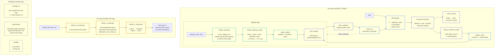

# infinity-scheduler (dev-cherrypick)

A fair-share CPU scheduler based on the limit concept in mathematics — every scheduling parameter approaches its bound asymptotically without discrete thresholds. Interactive tasks that sleep frequently naturally keep their budget while CPU-bound tasks converge toward a minimum, and real-time tasks get adaptive RR timeslices based on CPU burstiness. Built into CFS/EEVDF and RT with a focus on desktop interactivity.

> [!TIP]
> **TL;DR — dev-cherrypick**
> - EMA: asymmetric τ (climb 96ms, decay 24ms), two-pole correction
> - Wakeup decay: 2nd-order Taylor expansion (e^-x ≈ 1 - x + x²/2), continuous
> - Slice: ×8/10 slope (max 5×), 50% proportional min, hrtick deadline precision
> - EMA self-stabilizing: no thresholds, no bypasses needed
> - Uclamp: reads sched_util_min from userspace task declarations, no hooks
> - Safety: 128-bit overflow protection, carriage auto-scales from CPU count
> - RT: continuous Taylor decay, adaptive RR timeslice (10–100ms)
> - Only two tunables: smt_divisor and running (ro)


```mermaid
flowchart TB
    classDef fair fill:#0000,stroke:#3b82f6,stroke-width:2
    classDef algo fill:#0000,stroke:#6366f1,stroke-width:2
    classDef wake fill:#0000,stroke:#14b8a6,stroke-width:2
    classDef rtN fill:#0000,stroke:#d97706,stroke-width:2
    classDef infra fill:#0000,stroke:#94a3b8,stroke-width:2

    subgraph FAIR["Fair tasks (SCHED_OTHER)"]
        TASK["Task"] --> GAUGE["EMA gauge\n \n0 → BUDGET_MAX\nτ_climb 96ms\nτ_decay 24ms"]
        class GAUGE fair

        GAUGE --> TWOPOLE["two-pole correction\n \neffective = ema − Δema/2\nneutral at wakeup"]
        class TWOPOLE algo

        TWOPOLE --> SLICE["infinity_slice()\n \nEMA↑ → slice↓\nmin 50% of share"]
        class SLICE algo

        TWOPOLE --> VRT["infinity_vruntime_scale()\n \n×8/10 slope, max 5×\n+ uclamp bypass"]
        class VRT algo

        VRT --> UPD["update_curr()\nvruntime += scaled_delta"]
        class UPD fair

        UPD --> PICK["pick_eevdf()\n \nEEVDF tree\nearliest deadline wins"]
        class PICK algo

        PICK --> FUTEX["futex_waiting?\nbypass protect_slice"]
        class FUTEX algo

        FUTEX --> RUN["Task runs\nuntil block or preempt"]
        class RUN fair

        subgraph WAKEUP["Wakeup path"]
            WQ["enqueue_task_fair()"]
            WQ --> DECAY["infinity_wakeup()\n \nema = f(sleep_ns)\nperiod-shift bounds tracking\n& 128-bit math safety"]
            DECAY --> WUP["infinity_wakeup_scale()\n \nvslice' = vslice × ema / BUDGET_MAX\n→ 0 as ema → 0, no cap"]
            WUP --> PLACE["place_entity()\ndeadline = vruntime + vslice'"]
            PLACE --> PICK
        end
        class DECAY,WUP,PLACE wake

        RUN -. "block / preempt" .-> WAKEUP
        RUN --> GAUGE
    end

    subgraph RT["RT tasks (SCHED_RR only)"]
        RT_T["SCHED_RR task runs"] --> RT_C["infinity_rt_consume()\n \nrt_ema climbs with runtime"]
        class RT_C rtN

        RT_C --> RT_D["infinity_rt_wakeup()\n \ntime-proportional decay\n2nd-order Taylor expansion\ndedicated rt_last_sleep_ns"]
        class RT_D rtN

        RT_D --> RT_S["infinity_rr_timeslice()\n \nrt_ema↑ → timeslice↓\n100ms → 10ms"]
        class RT_S rtN

        RT_S --> RT_Q["Task stays in\noriginal priority queue\n(no priority demotion)"]
    end

    subgraph INFRA["Scheduler infrastructure"]
        AC["carriage_ns\n \nauto-scaled from CPU count\n1 + ilog min(cpus, 8)"]
        OF["sleep decay\n \n2nd-order Taylor expansion\nperiod-shift bounds < 63\n128-bit math safety"]
        TU["tunables\n \nsmt_divisor\nrunning (ro)"]
    end
    class AC,OF,TU infra
```

## Quick start

```bash
# 1. Clone the dev-cherrypick branch
git clone -b dev-cherrypick https://github.com/galpt/infinity-scheduler.git
cd infinity-scheduler

# 2. Build and install (detects running kernel version automatically)
sudo bash tools/install-infinity-scheduler.sh

# 3. Reboot and select "Infinity scheduler kernel" at the boot menu
reboot
```

> [!TIP]
> `sudo bash tools/install-infinity-scheduler.sh --remove` removes only Infinity
> scheduler boot entries — the default kernel is never touched.

```bash
# Verify it's running
uname -r                              # → 7.0.12-infinity
sysctl kernel.infinity_running        # → kernel.infinity_running = 1
sudo dmesg | grep Infinity            # → Infinity scheduler active: carriage=...
```

## Project structure

```
.
├── src/                    ★ Reference implementation (kernel/sched/infinity_sched.[ch])
├── patches/stable/         0001-infinity-scheduler.patch for each kernel version
├── tools/                  Install script, build helpers, patch fixers
├── CONTRIBUTING.md
└── LICENSE
```

Patches for version X.Y apply to all X.Y.Z point releases with `patch -F 3`.

## Tunables

| Parameter | Default | Range | Description |
|---|---|---|---|
| `infinity_smt_divisor` | 2 | [1, 16] | SMT secondary slice divisor (1 = no halving) |
| `infinity_running` | 1 (ro) | — | Active flag |

The base fair-share window (`carriage_ns`) is auto-scaled from CPU count at init,
matching stock EEVDF's CPU-count scaling behaviour.  No user tunable is needed.

## Feature comparison

| Feature | scx_flow 3.1.0 | infinity-scheduler |
|---|---|---|
| Fair-share slice | Yes | Yes |
| Budget model | Linear consumption | **EMA (Limitless)** |
| SMT halving | No | Yes |
| EEVDF Invariant Assert | N/A (BPF) | **Yes (WARN_ON_ONCE)** |
| Wakeup deadline boost | N/A | **Asymptotic vslice** |
| Work stealing | Yes (BPF) | No (not needed — EEVDF + kernel load balancer) |
| Adaptive RR timeslice | No | **Yes (rt_ema-based, 10–100ms)** |

## License

GPL-2.0

## Credits

- **[EEVDF](https://git.kernel.org/pub/scm/linux/kernel/git/torvalds/linux.git/tree/kernel/sched/fair.c)** — Earliest Eligible Virtual Deadline First scheduling algorithm by Ion Stoica and Hussein Abdel-Wahab (1995), implemented in the Linux kernel by Peter Zijlstra and the kernel community. EEVDF serves as the foundation that the Infinity scheduler modifies.
- **[scx_flow 3.1.0](https://github.com/sched-ext/scx/tree/main/scheds/experimental/scx_flow)** — BPF sched-ext fair-share scheduler by the sched-ext community. The budget model and interactive floor logic are adapted from this implementation.
- **[BORE](https://github.com/firelzrd/bore-scheduler)** — Burst-Oriented Response Enhancer scheduler by Masahito S ([firelzrd](https://github.com/firelzrd)). BORE's approach to CPU-bound task suppression through burst scoring provided a reference point for Infinity's accelerating consumption design.
- **[BMQ / PDS / LF-BMQ](https://gitlab.com/alfredchen/projectc)** — BitMap Queue schedulers by Alfred Chen (Project C). Research into BMQ's complete scheduler replacement approach validated the decision to keep Infinity within EEVDF rather than replacing it entirely.
- **[LINUX DO](https://linux.do/)** — Chinese Linux community where the Infinity scheduler is discussed and promoted. Feedback from the community helps shape the project's development direction.
- **[CachyOS community](https://cachyos.org/)** — Testers and early adopters who provided real-world feedback during development, helping validate the scheduler's behavior under diverse workloads.
