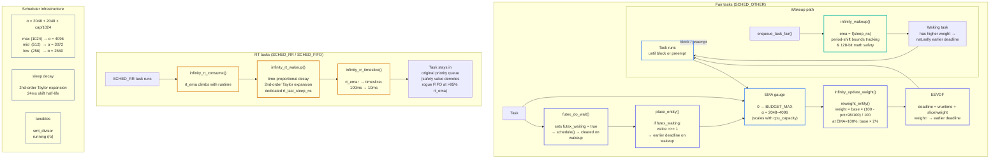

# infinity-scheduler (v4.6-gpu)

A fair-share CPU scheduler based on the limit concept in mathematics — every scheduling parameter approaches its bound asymptotically without discrete thresholds. Interactive tasks that sleep frequently naturally keep their budget while CPU-bound tasks converge toward a minimum, and real-time tasks get adaptive RR timeslices based on CPU burstiness. Built into CFS/EEVDF and RT with a focus on desktop interactivity.


```mermaid
flowchart TB
    classDef fair fill:#0000,stroke:#3b82f6,stroke-width:2
    classDef algo fill:#0000,stroke:#6366f1,stroke-width:2
    classDef wake fill:#0000,stroke:#14b8a6,stroke-width:2
    classDef rtN fill:#0000,stroke:#d97706,stroke-width:2
    classDef infra fill:#0000,stroke:#94a3b8,stroke-width:2

    subgraph FAIR["Fair tasks (SCHED_OTHER)"]
        TASK["Task"] --> GAUGE["EMA gauge\n \n0 → BUDGET_MAX\nα = 2048–4096\n(scales with cpu_capacity)"]
        class GAUGE fair

        GAUGE --> WEIGHT["infinity_update_weight()\n \nreweight_entity()\nweight = base × (100 - pct×98/100) / 100\nat EMA=100%: base × 2%"]
        class WEIGHT algo

        WEIGHT --> EEVDF["EEVDF\n \ndeadline = vruntime + slice/weight\nweight↑ → earlier deadline"]

        TASK --> FUTEX["futex_do_wait()\n \nsets futex_waiting = true\n→ schedule() → cleared on wakeup"]
        class FUTEX algo

        FUTEX --> PLACE["place_entity()\n \nif futex_waiting:\nvslice >>= 1\n→ earlier deadline on wakeup"]
        class PLACE algo

        PLACE --> GAUGE
        class EEVDF algo

        EEVDF --> RUN["Task runs\nuntil block or preempt"]
        class RUN fair

        subgraph WAKEUP["Wakeup path"]
            WQ["enqueue_task_fair()"]
            WQ --> DECAY["infinity_wakeup()\n \nema = f(sleep_ns)\nperiod-shift bounds tracking\n& 128-bit math safety"]
            DECAY --> WAKE["Waking task\nhas higher weight →\nnaturally earlier deadline"]
            WAKE --> RUN
        end
        class DECAY wake

        RUN -. "block / preempt" .-> WAKEUP
        RUN --> GAUGE
    end

    subgraph RT["RT tasks (SCHED_RR / SCHED_FIFO)"]
        RT_T["SCHED_RR task runs"] --> RT_C["infinity_rt_consume()\n \nrt_ema climbs with runtime"]
        class RT_C rtN

        RT_C --> RT_D["infinity_rt_wakeup()\n \ntime-proportional decay\n2nd-order Taylor expansion\ndedicated rt_last_sleep_ns"]
        class RT_D rtN

        RT_D --> RT_S["infinity_rr_timeslice()\n \nrt_ema↑ → timeslice↓\n100ms → 10ms"]
        class RT_S rtN

        RT_S --> RT_Q["Task stays in\noriginal priority queue\n(safety valve demotes\nrogue FIFO at >95% rt_ema)"]
    end

    subgraph INFRA["Scheduler infrastructure"]
        AC["α = 2048 + 2048 × cap/1024\n \nmax (1024) → α = 4096\nmid  (512)  → α = 3072\nlow  (256)  → α = 2560"]
        OF["sleep decay\n \n2nd-order Taylor expansion\n24ms shift half-life"]
        TU["tunables\n \nsmt_divisor\nrunning (ro)"]
    end
    class AC,OF,TU infra
```

## Quick start

```bash
# 1. Clone the repo (v4.6 has latest features; v4.5 is stable baseline)
git clone -b v4.6-gpu https://github.com/galpt/infinity-scheduler.git
cd infinity-scheduler

# 2. Build and install (detects running kernel version automatically)
sudo bash tools/install-infinity-scheduler.sh

# 3. Reboot and select "Infinity scheduler kernel" at the boot menu
reboot
```

> [!TIP]
> `sudo bash tools/install-infinity-scheduler.sh --remove` removes only Infinity
> scheduler boot entries — the default kernel is never touched.

```bash
# Verify it's running
uname -r                              # → 7.1-infinity
sysctl kernel.infinity_running        # → kernel.infinity_running = 1
sudo dmesg | grep Infinity            # → Infinity scheduler active: smt_divisor=...
```

## Project structure

```
.
├── src/                    ★ Reference implementation (kernel/sched/infinity_sched.[ch])
├── patches/stable/         0001-infinity-scheduler.patch for each kernel version
├── tools/                  Install script, build helpers, patch fixers
├── CONTRIBUTING.md
└── LICENSE
```

Each `0001-infinity-scheduler.patch` is a `git format-patch` cumulative series
applicable via `git am` on the matching upstream kernel tag.  `patch -F 3` works
but `git am` preserves commit metadata (author, date, sign-off).

## Tunables

| Parameter | Default | Range | Description |
|---|---|---|---|
| `infinity_smt_divisor` | 2 | [1, 16] | SMT secondary slice divisor (1 = no halving) |
| `infinity_running` | 1 (ro) | — | Active flag |

Infinity uses EEVDF's native per-task weight as its control variable — no
separate fair-share window is needed.  The EMA climb time constant is
approximately 0.5ms at the default alpha (3072), scaling from 0.38ms
(alpha 4096 at max cpu_capacity) to 0.67ms (alpha 2048 at low capacity).
This gives sub-millisecond reaction to CPU-bound threads on any hardware.
No user tunable is needed beyond the SMT divisor.

## Feature comparison

| Feature | scx_flow 3.1.0 | infinity-scheduler |
|---|---|---|
| Fair-share slice | Yes | Yes |
| Budget model | Linear consumption | **EMA (Limitless)** |
| SMT halving | No | Yes |
| EEVDF Invariant Assert | N/A (BPF) | **Yes (WARN_ON_ONCE)** |
| Wakeup deadline boost | N/A | **Asymptotic vslice** |
| Work stealing | Yes (BPF) | No (not needed — EEVDF + kernel load balancer) |
| Adaptive RR timeslice | No | **Yes (rt_ema-based, 10–100ms)** |
| Hardware-adaptive alpha | No | **Yes (2048–4096 via cpu_capacity)** |
| Futex IPC wakeup boost | No | **Yes (vslice halved on futex wakeup)** |
| Migration hysteresis | No | **Yes (EMA-driven cache pinning)** |
| Cgroup defense shield | No | **Yes (aggregate group EMA)** |
| RT cross-class safety | No | **Yes (native requeue throttling)** |
| Asymmetric core placement | No | **Yes (EMA-guided P/E core bias)** |
| GPU time tracking | No | **Yes (EMA per DRM entity)** |
| Virtual GPU time scheduling | No | **Yes (DRM_SCHED_POLICY_INFINITY)** |
| Soft priority (anti-starvation) | No | **Yes (proportional vtime scaling)** |
| Cross-scheduler interactivity | No | **Yes (CPU EMA feeds GPU vtime)** |

## License

GPL-2.0

## Credits

- **[EEVDF](https://git.kernel.org/pub/scm/linux/kernel/git/torvalds/linux.git/tree/kernel/sched/fair.c)** — Earliest Eligible Virtual Deadline First scheduling algorithm by Ion Stoica and Hussein Abdel-Wahab (1995), implemented in the Linux kernel by Peter Zijlstra and the kernel community. EEVDF serves as the foundation that the Infinity scheduler modifies.
- **[scx_flow 3.1.0](https://github.com/sched-ext/scx/tree/main/scheds/experimental/scx_flow)** — BPF sched-ext fair-share scheduler by the sched-ext community. The budget model and interactive floor logic are adapted from this implementation.
- **[BORE](https://github.com/firelzrd/bore-scheduler)** — Burst-Oriented Response Enhancer scheduler by Masahito S ([firelzrd](https://github.com/firelzrd)). BORE's approach to CPU-bound task suppression through burst scoring provided a reference point for Infinity's accelerating consumption design.
- **[BMQ / PDS / LF-BMQ](https://gitlab.com/alfredchen/projectc)** — BitMap Queue schedulers by Alfred Chen (Project C). Research into BMQ's complete scheduler replacement approach validated the decision to keep Infinity within EEVDF rather than replacing it entirely.
- **[LINUX DO](https://linux.do/)** — Chinese Linux community where the Infinity scheduler is discussed and promoted. Feedback from the community helps shape the project's development direction.
- **[CachyOS community](https://cachyos.org/)** — Testers and early adopters who provided real-world feedback during development, helping validate the scheduler's behavior under diverse workloads.
- **[u3z05en](https://github.com/u3z05en)** — Jonathan, for helping with the code review, addressing several subtle issues that made Infinity more correct and robust.
- **[lostf1sh](https://github.com/lostf1sh)** — Bug reports and code review, helping identify issues and improve the scheduler's correctness.
