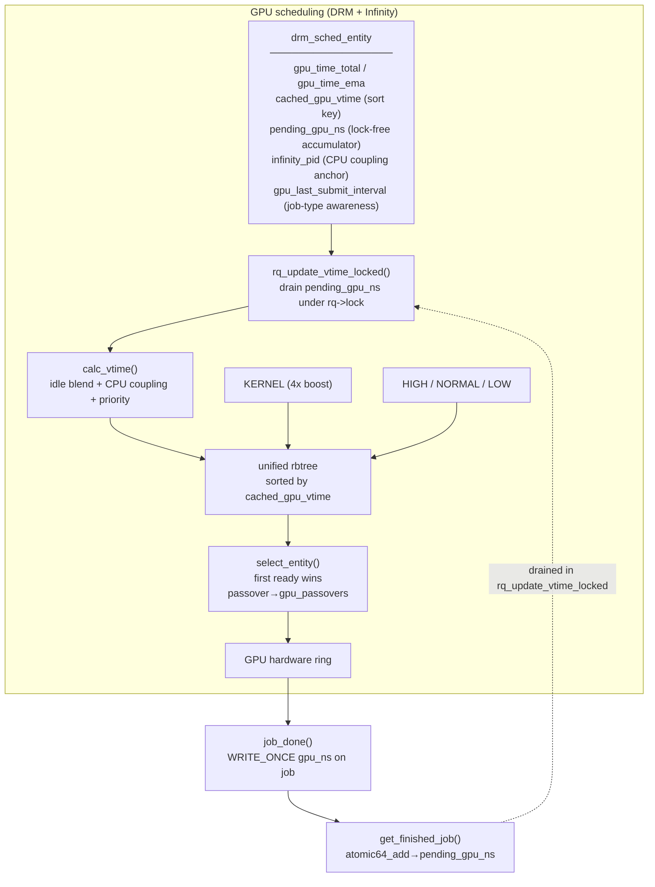

# infinity-scheduler (v4.7-gpu)

A fair-share CPU + GPU scheduler based on the limit concept in mathematics — every scheduling parameter approaches its bound asymptotically without discrete thresholds.

## Project structure

> [!NOTE]
> If you want support for a specific distro (e.g., Debian/Ubuntu) or a specific kernel version (e.g., 7.1 for Fedora), please open a new [Issue](https://github.com/galpt/infinity-scheduler/issues) for that.

```
.
├── src/                    ★ Reference implementation (kernel/sched/infinity_sched.[ch])
├── patches/
│   ├── arch/6.18/            23 patches — Vanilla kernel.org 6.18
│   ├── arch/7.0/             23 patches — Vanilla kernel.org 7.0
│   ├── arch/7.1/             23 patches — Vanilla kernel.org 7.1
│   ├── arch/7.2/             12 patches — Vanilla kernel.org 7.2 (RC base)
│   └── fedora/7.0/           23 patches — Fedora kernel-ark archived-7.0
├── tools/                     Install script, build helpers, patch fixers
├── CONTRIBUTING.md
└── LICENSE
```

## Quick start

> [!NOTE]
> The install script below is tested and working with the **Limine** bootloader. Support for **GRUB** and **systemd-boot** has been added but not yet tested on real hardware. If you encounter issues or have a working version for your bootloader, please send a pull request.

```bash
# 1. Clone the repo (v4.7-gpu adds cpufreq hint, SMT placement, GPU job-type awareness; v4.6-gpu is stable GPU baseline)
git clone -b v4.7-gpu --depth 1 https://github.com/galpt/infinity-scheduler.git
cd infinity-scheduler

# 2. Build and install (detects running kernel version automatically)
sudo bash tools/install-infinity-scheduler.sh

# 3. Reboot and select "Infinity scheduler kernel" at the boot menu
reboot
```

> [!TIP]
> 1. To free up disk space after Infinity has compiled successfully, use the `bash tools/safe-clean-infinity-kernel-source.sh` command.
> 2. To uninstall Infinity completely, use the `sudo bash tools/install-infinity-scheduler.sh --remove` command. It removes only Infinity scheduler boot entries — the default kernel is never touched.

```bash
# Verify it's running
uname -r                              # → 7.1-infinity
sysctl kernel.infinity_running        # → kernel.infinity_running = 1
sysctl kernel.infinity_version        # → kernel.infinity_version = v4.7-gpu
sudo dmesg | grep Infinity            # → Infinity scheduler active: smt_divisor=...

# Check GPU scheduling health
cat /proc/sys/kernel/infinity_stats   # → CPU + GPU accounting table
```

> [!NOTE]
> Use `cat` instead of `sysctl` for `infinity_stats` — it outputs a multi-line table that `sysctl` cannot display properly. The stats include idle compensation, cross-scheduler coupling, and drain counters.

## Tunables

| Parameter | Default | Range | Description |
|---|---|---|---|
| `infinity_smt_divisor` | 2 | [1, 16] | SMT secondary slice divisor (1 = no halving) |
| `infinity_running` | 1 (ro) | — | Active flag |
| `infinity_version` | v4.7-gpu (ro) | — | Branch version string |
| `infinity_stats` | — (ro) | — | CPU + GPU accounting table with cross-scheduler coupling and drain counters |

## CPU scheduling


```mermaid
flowchart TB
    classDef fair fill:#0000,stroke:#3b82f6,stroke-width:2
    classDef algo fill:#0000,stroke:#6366f1,stroke-width:2
    classDef wake fill:#0000,stroke:#14b8a6,stroke-width:2
    classDef rtN fill:#0000,stroke:#d97706,stroke-width:2
    classDef infra fill:#0000,stroke:#94a3b8,stroke-width:2

    subgraph FAIR["Fair tasks (SCHED_OTHER)"]
        TASK["Task"] --> GAUGE["EMA gauge\n───\n0 → BUDGET_MAX\nα = 2048–4096\n(scales with cpu_capacity)"]
        class GAUGE fair

        GAUGE --> WEIGHT["infinity_update_weight()\n───\nreweight_entity()\nweight = base × (100 - pct×98/100) / 100\nat EMA=100%: base × 2%"]
        class WEIGHT algo

        WEIGHT --> EEVDF["EEVDF\n───\ndeadline = vruntime + slice/weight\nweight↑ → earlier deadline"]

        TASK --> FUTEX["futex_do_wait()\n───\nsets futex_waiting = true\n→ schedule() → cleared on wakeup"]
        class FUTEX algo

        FUTEX --> PLACE["place_entity()\n───\nif futex_waiting:\nvslice >>= 1\n→ earlier deadline on wakeup"]
        class PLACE algo

        PLACE --> GAUGE
        class EEVDF algo

        EEVDF --> RUN["Task runs\nuntil block or preempt"]
        class RUN fair

        subgraph WAKEUP["Wakeup path"]
            WQ["enqueue_task_fair()"]
            WQ --> DECAY["infinity_wakeup()\n───\nema = f(sleep_ns)\nperiod-shift bounds tracking\n& 128-bit math safety"]
            DECAY --> WAKE["Waking task\nhas higher weight →\nnaturally earlier deadline"]
            WAKE --> RUN
        end
        class DECAY wake

        RUN -. "block / preempt" .-> WAKEUP
        RUN --> GAUGE
    end

    subgraph RT["RT tasks (SCHED_RR / SCHED_FIFO)"]
        RT_T["SCHED_RR task runs"] --> RT_C["infinity_rt_consume()\n───\nrt_ema climbs with runtime"]
        class RT_C rtN

        RT_C --> RT_D["infinity_rt_wakeup()\n───\ntime-proportional decay\n2nd-order Taylor expansion\ndedicated rt_last_sleep_ns"]
        class RT_D rtN

        RT_D --> RT_S["infinity_rr_timeslice()\n───\nrt_ema↑ → timeslice↓\n100ms → 10ms"]
        class RT_S rtN

        RT_S --> RT_Q["Task stays in\noriginal priority queue\n(safety valve demotes\nrogue FIFO at >95% rt_ema)"]
    end

    subgraph INFRA["Scheduler infrastructure"]
        AC["α = 2048 + 2048 × cap/1024\n───\nmax (1024) → α = 4096\nmid  (512)  → α = 3072\nlow  (256)  → α = 2560"]
        OF["sleep decay\n───\n2nd-order Taylor expansion\n24ms shift half-life"]
        TU["tunables & stats\n───\nsmt_divisor\nrunning (ro)\nversion (ro)\nstats (ro)"]
    end
    class AC,OF,TU infra
```

## GPU scheduling


```mermaid
flowchart TB
    classDef ent fill:#0000,stroke:#818cf8,stroke-width:2
    classDef algo fill:#0000,stroke:#14b8a6,stroke-width:2
    classDef dec fill:#0000,stroke:#d97706,stroke-width:2

    subgraph GPU["GPU scheduling (DRM + Infinity)"]
        ENTITY["drm_sched_entity
─────────────────
gpu_time_total / gpu_time_ema
cached_gpu_vtime (sort key)
pending_gpu_ns (lock-free accumulator)
infinity_pid (CPU coupling anchor)
gpu_last_submit_interval (job-type awareness)"]

        ENTITY --> DRAIN["rq_update_vtime_locked()
drain pending_gpu_ns under rq->lock"]
        DRAIN --> VTIME["calc_vtime()
idle blend + CPU coupling + priority"]

        VTIME --> QUEUE["unified rbtree
sorted by cached_gpu_vtime"]

        KERNEL["KERNEL (4x boost)"]
        USER["HIGH / NORMAL / LOW"]

        KERNEL --> QUEUE
        USER --> QUEUE
        QUEUE --> SELECT["select_entity()
first ready wins
passover→gpu_passovers"]

        SELECT --> HW["GPU hardware ring"]
    end

    HW --> DONE["job_done()
WRITE_ONCE gpu_ns on job"]

    DONE --> FINI["get_finished_job()
atomic64_add→pending_gpu_ns"]

    FINI -. "drained in rq_update_vtime_locked" .-> DRAIN
```

## Feature comparison

| Feature | scx_flow 3.1.0 | infinity-scheduler |
|---|---|---|
| Fair-share slice | Yes | Yes |
| Budget model | Linear consumption | EMA |
| SMT halving | No | Yes |
| EEVDF Invariant Assert | N/A (BPF) | Yes (WARN_ON_ONCE) |
| Wakeup deadline boost | N/A | Asymptotic vslice |
| Work stealing | Yes (BPF) | No (not needed — EEVDF + kernel load balancer) |
| Adaptive RR timeslice | No | Yes (rt_ema-based, 10–100ms) |
| Hardware-adaptive alpha | No | Yes (2048–4096 via cpu_capacity) |
| Futex IPC wakeup boost | No | Yes (vslice halved on futex wakeup) |
| Migration hysteresis | No | Yes (EMA-driven cache pinning) |
| Cgroup defense shield | No | Yes (aggregate group EMA) |
| RT cross-class safety | No | Yes (native requeue throttling) |
| Asymmetric core placement | No | Yes (EMA-guided P/E core bias) |
| GPU time tracking | No | Yes (EMA per DRM entity) |
| Virtual GPU time scheduling | No | Yes (sole Infinity policy, FIFO/RR removed) |
| Soft priority (anti-starvation) | No | Yes (proportional vtime scaling) |
| Cross-scheduler CPU-GPU coupling | No | Yes (futex/EMA → GPU vtime + GPU passover → CPU) |
| EMA-driven cpufreq hint | No | Yes (v4.7: SCHED_CPUFREQ_INTERACTIVE flag) |
| SMT interactive placement | No | Yes (v4.7: low-EMA tasks moved to idle core) |
| GPU job-type awareness | No | Yes (v4.7: submission interval reduces compositor penalty) |
| Per-process EMA visibility | No | Yes (v4.7: `/proc/<pid>/infinity`) |

## License

GPL-2.0

## Credits

- **[EEVDF](https://git.kernel.org/pub/scm/linux/kernel/git/torvalds/linux.git/tree/kernel/sched/fair.c)** — Earliest Eligible Virtual Deadline First scheduling algorithm by Ion Stoica and Hussein Abdel-Wahab (1995), implemented in the Linux kernel by Peter Zijlstra and the kernel community. EEVDF serves as the foundation that the Infinity scheduler modifies.
- **[scx_flow 3.1.0](https://github.com/sched-ext/scx/tree/main/scheds/experimental/scx_flow)** — BPF sched-ext fair-share scheduler by the sched-ext community. The budget model and interactive floor logic are adapted from this implementation.
- **[BORE](https://github.com/firelzrd/bore-scheduler)** — Burst-Oriented Response Enhancer scheduler by Masahito S ([firelzrd](https://github.com/firelzrd)). BORE's approach to CPU-bound task suppression through burst scoring provided a reference point for Infinity's accelerating consumption design.
- **[BMQ / PDS / LF-BMQ](https://gitlab.com/alfredchen/projectc)** — BitMap Queue schedulers by Alfred Chen (Project C). Research into BMQ's complete scheduler replacement approach validated the decision to keep Infinity within EEVDF rather than replacing it entirely.
- **[Tvrtko Ursulin — Fair(er) DRM GPU scheduler](https://blogs.igalia.com/tursulin/fair-er-drm-gpu-scheduler/)** — Igalia blog post demonstrating a CFS-inspired fair scheduler for the DRM GPU scheduler. The approach to unified virtual time scheduling and priority de-strictification directly informs Infinity's GPU extension.
- **[LINUX DO](https://linux.do/)** — Chinese Linux community where the Infinity scheduler is discussed and promoted. Feedback from the community helps shape the project's development direction.
- **[CachyOS community](https://cachyos.org/)** — Testers and early adopters who provided real-world feedback during development, helping validate the scheduler's behavior under diverse workloads.
- **[u3z05en](https://github.com/u3z05en)** — Jonathan, for helping with the code review, addressing several subtle issues that made Infinity more correct and robust.
- **[lostf1sh](https://github.com/lostf1sh)** — Bug reports and code review, helping identify issues and improve the scheduler's correctness.
- **[RiverOnVenus](https://github.com/RiverOnVenus)** — Code review, helping identify issues and improve the scheduler's correctness.
